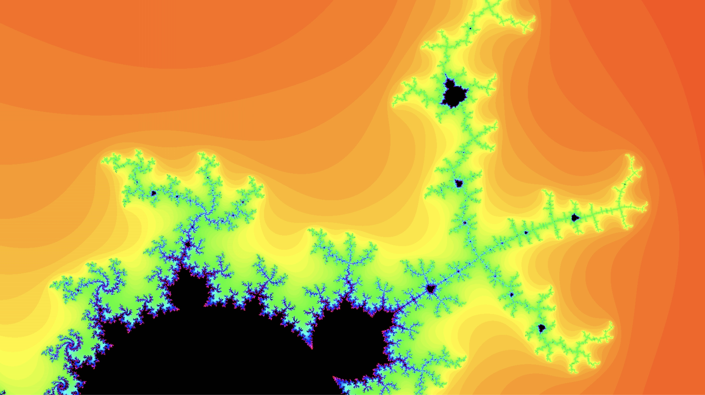

# Mandelbrot 🌌

## Introduction 🌟

The `mandelbrot` project is an interactive visualization of the Mandelbrot set, a renowned fractal known for its intricate and mesmerizing patterns. This application allows users to delve into different regions of the Mandelbrot set, offering a unique and captivating experience.

## Features 🚀

- **Interactive Visualization:** 🖼️ Pan and zoom to explore various areas of the Mandelbrot set.
- **Dynamic Coloring:** 🎨 Employing vibrant color schemes to showcase the fractal's complexity.
- **Floating Controls:** ⚙️ Real-time controls for adjusting parameters like zoom and pan.
- **Fractal View:** 🌀 (WIP) A dedicated view for exploring the famed different area of the Mandelbrot set.

## Planned Features 📅

- **Enhanced Performance:** ⚡ Optimizations for smoother zooming and panning.
- **Mobile Responsiveness:** 📱 Ensuring a seamless experience on various devices.
- **User-Defined Bookmarks:** 📌 Allowing users to save and revisit their favorite locations in the fractal.
- **Educational Mode:** 🎓 An informative guide to understanding fractals and the Mandelbrot set.

## Fractal Gallery 🖼️



## JavaScript (JS) Version 🌐

### Installation 💾

Clone the repository and install dependencies:

```bash
git clone https://github.com/amalshehu/mandelbrot.git
cd mandelbrot/js
pnpm install
```

### Running the Application 🖥️

Start the application locally:

```bash
pnpm dev
```

Open `http://localhost:3000` in your browser to explore the Mandelbrot set.

### Usage 🛠️

- **Pan:** 🚶‍♂️ Click and drag or use arrow keys to navigate.
- **Zoom:** 🔍 Use the mouse wheel or zoom slider to adjust the view.

## Rust Version 🦀

### Getting Started

#### Dependencies

Before running the application, ensure you have the following dependencies installed:

- Rust programming language
- Rust dependencies specified in `Cargo.toml`
- Vulkan or Metal-supported GPU

#### Running the Application

To run the application, execute the following commands in your terminal:

```shell
$ cd mandelbrot/rust
$ cargo build --release
$ cargo run
```

### Features

#### Real-time Visualization

- 🌀 Real-time rendering of the Mandelbrot Set.
- 🌈 Colorful visualization based on the Mandelbrot fractal.

#### Zoom and Pan

- 🔍 Zoom in and out with mouse input.
- 📌 Pan the Mandelbrot Set to explore different regions.

#### Adaptive Resolution

- 🖥️ Automatically adjusts rendering resolution upon window resizing.
- 🔄 Redraws the Mandelbrot Set with the updated resolution.

### Shader Explanation

The Mandelbrot Set visualization relies on two shaders, **vertex shader** and **fragment shader**, which are responsible for rendering the fractal.

#### Vertex Shader (vs_main)

- 🎯 Calculates the position of vertices in normalized device coordinates.
- 🧩 Transforms vertex positions.

#### Fragment Shader (fs_main)

- 🖌️ Generates colors for each fragment using the Mandelbrot algorithm.
- 🌟 Iteratively calculates the Mandelbrot fractal and assigns colors based on iterations.

### Interactivity

#### Zoom and Pan

- 🖱️ Left-click and drag to zoom in/out.
- 🌍 Pan the Mandelbrot Set by moving the mouse.

## License 📜

`mandelbrot` is open-source software under the [MIT License](LICENSE).
